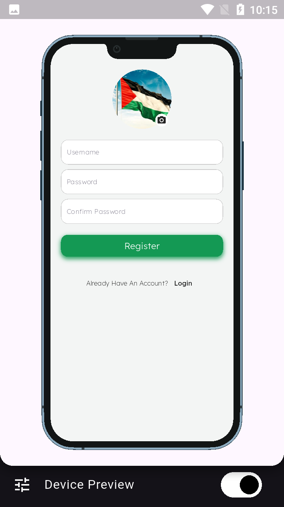
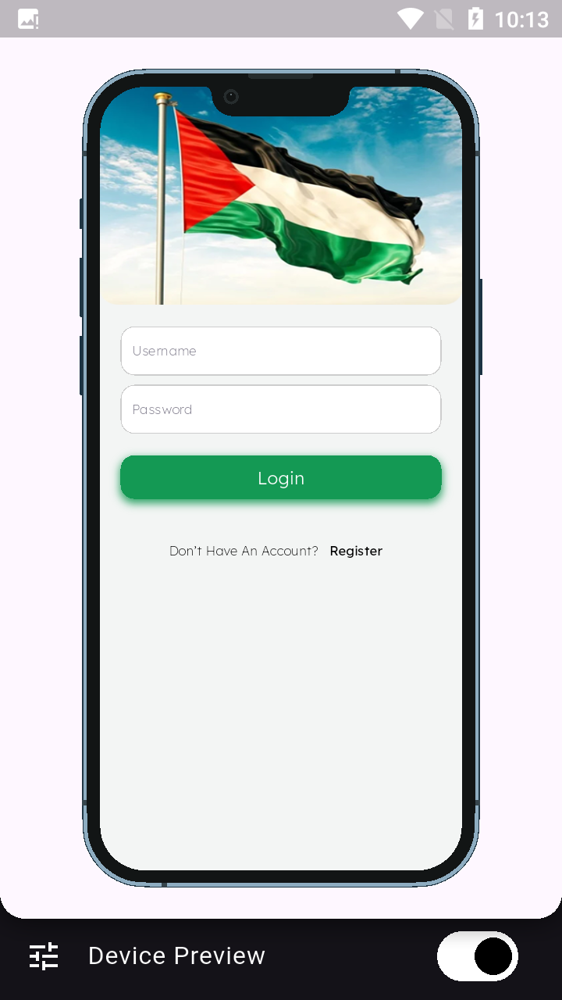
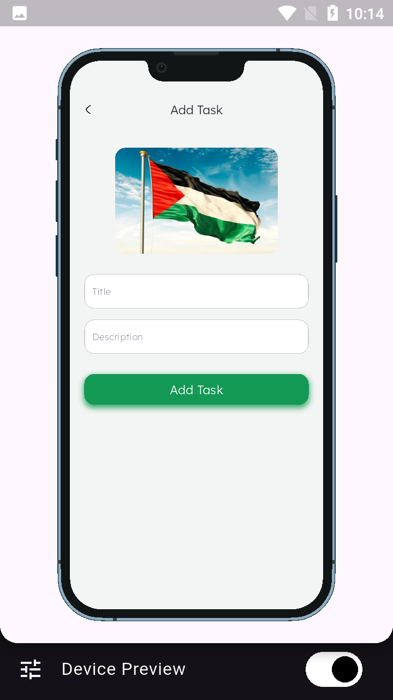
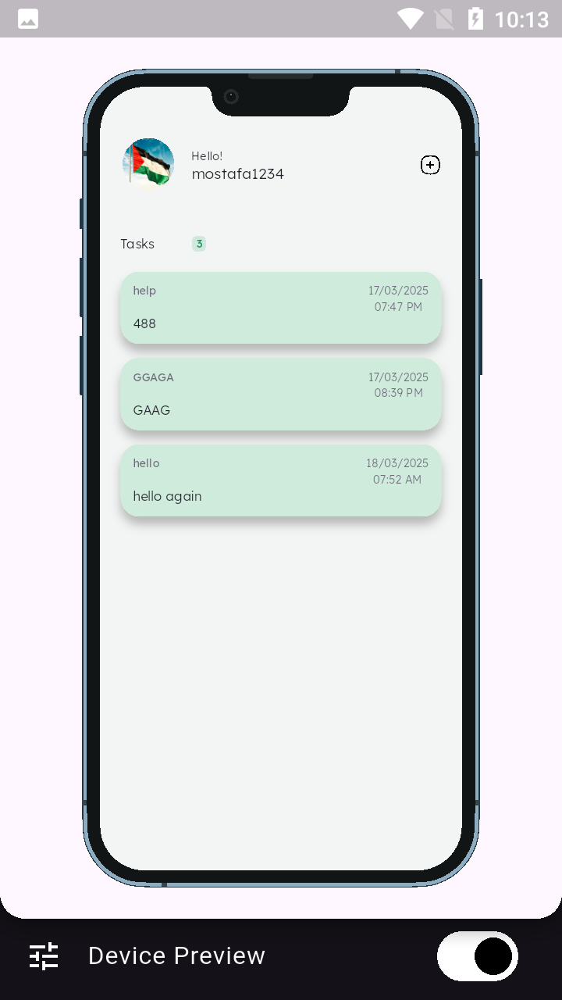
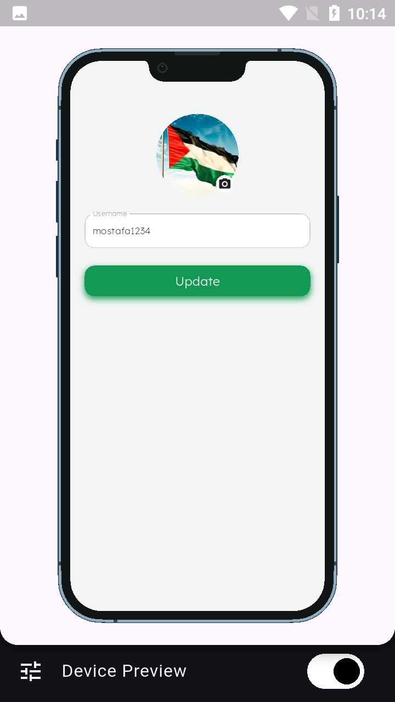
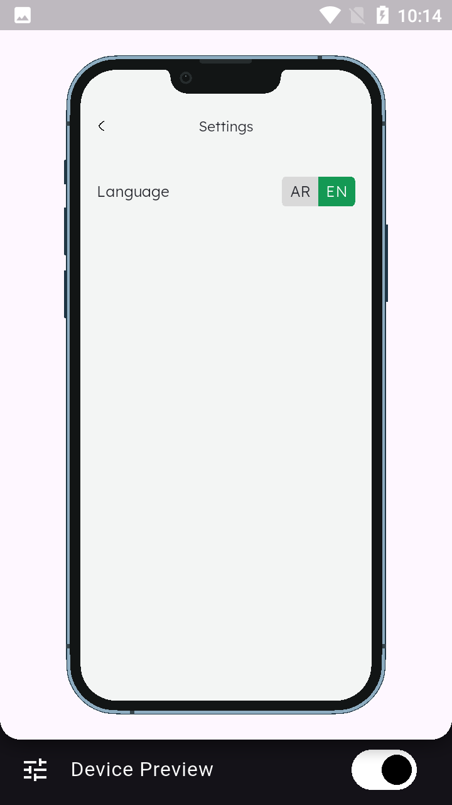
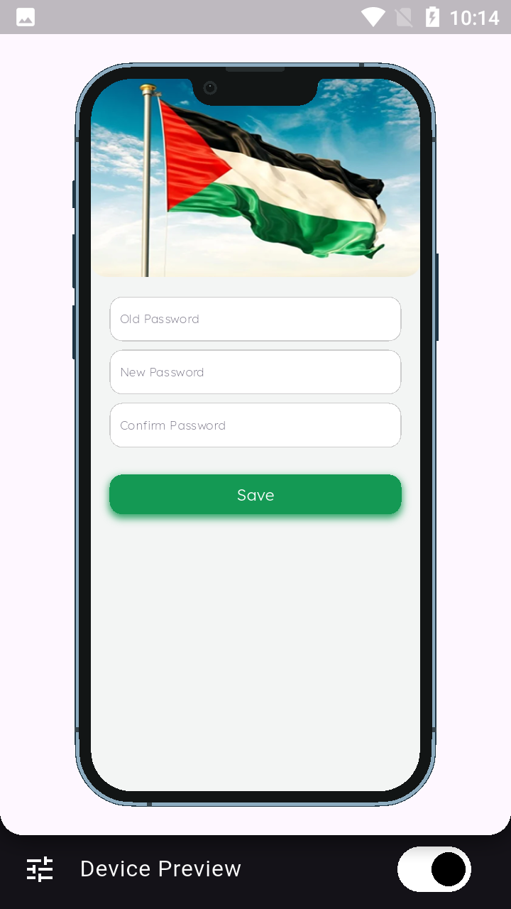

# to_do_app

🚀 *A simple and efficient task management app built with Flutter.*  

## 📌 Features  
- 📝 Add, edit, and delete tasks  
- 📆 Set due dates and reminders   
- 🔄 Sync tasks across devices (Future update)
  
## 📸 Preview  
### 🖼 Screenshots  
  

  

  

 

### 📽 Demo Video  
[![Watch video ]](https://drive.google.com/drive/folders/1okM6KNvGFgRJY3mF9ypc6UBIIBqE9jPf)
